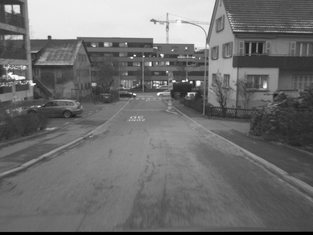

# Exposure Control with Event Camera

## About Exposure Control

Camera is one of the most fundamental sensors in modern day vehicles. One of the most important parameters to this sensor is the exposure control. Exposure control can be done by setting the right exposure time and gain (ISO) of a camera, guaranteeing that the camera catches the necessary information from the frame, which is an important premise when it comes to fast-paced applications like autonomous vehicles. Currently, the built-in Automatic Exposure (AE) algorithm in cameras is not robust enough nor is it quick enough to react to high dynamic ranges and quickly changing luminance of the frame. Many solutions have been developed to improve the automatic exposure control, while no approach has been made to utilize the Event Camera in order to make an effective exposure control algorithm. 

## Why Event Cameras? 

Event camera has a high dynamic range and low latency in delivering changes in brightness in a certain pixel. This advantage has been highlighted as more and more usage of event cameras are being researched, especially more for the highly dynamic autonomous driving field. 

## DSEC Dataset 

DSEC Dataset is a stereo event camera dataset for driving scenarios, provided by Gehrig et al. from UZH. 
This dataset was chosen to simulate event camera data for its high dynamic range at nighttime and also because it provided excellent pair of frame images and events. 

DSEC Dataset provides:
1. events and rectifying map in hdf format from both left and right event cameras,
2. rectified images from both left and right frame cameras, 
3. timestamp,
4. GT disparity images, events, and timestamp
5. calibration files
for each dataset, which can be interlaken, zurich city, thun, and etc. 

Unfortunately, since the event camera used in DSEC dataset is not a DAVIS camera, events and images both need preprocessing to be compared as a frame image.

Events are already undistorted, and still needs rectification, which is done in ./scripts/sequence.py
Events are also sliced in this process, according to the timestamp, while the number of bins and the time duration are variable parameters you can set in sequence.py:

```bash
dataset = Sequence(seq_path=seq_path, mode='train', delta_t_ms=15, num_bins=15) 
```

RGB frame images are already undistorted and rectified, but requires aligning to event frame. This is done in ./align.py


### Install

1. Clone

```bash
git clone git@github.com:uzh-rpg/DSEC.git
```

## Iterations 
#### Comparing event frame (stacked by time) vs. Image frame contour 

Event: stacked into 2D frame by adding polarity value to a certain pixel (x,y) within given timestamp duration. Stack is then binarized
Image: contours are drawn from images using Canny edge detector

Metrics used: 
1. Pixel-by-pixel comparison using MSE -> very high MSE, also minimum MSE was found when the image was black (very high gamma value)
2. Pixel overlay percentage -> seemed to give highest overlay percentage for gamma values that showed most structural information, but percentage was low (~20%) and no mathematical foundation to support metric
3. Histogram based similarity metrics used to compare the binary event stack and contour from frame image (also binary)
- EMD/Hausdorff Distance/SSIM/Bhattacharya Distance/Cosine Distance/Histogram Intersection/KL Divergence/Mutual Information from Scikit-learn
-> similarity metrics did not perform consistently for pixel based metrics. While the histogram based metrics did show more consisent result that highlighted the correct gamma values (brightness level) that shows most structural information, question arises that there is no point in binning binary images into histograms (which will only result in 2 bins, 0 and 255)

#### Comparing HOGs from event stack frame with HOGs from grayscale image frame

HOGs (histogram of orientation of gradients) are some strong indicators of structural information, since it captures the gradient's orientation in 8 directions. It was expected that comparing the similarity between HOGs from both event stack frame and grayscale image frame could result in a more noise-robust and find gamma values (brightness level) that maximizes the mutual structural information, but results were not promising.

It is interpreted that it is not easy to recognize key gradients from event stacks where there can be many noise, and also it could be that stacking the events plainly on 2D frame might not be the best way to represent events because it kills the temporal information in events. 

## Dense SIFT Descriptors Euclidean Distance Metric

Multiple approaches and metrics were practiced, but the by far computing for the euclidean distance of the Dense SIFT keypoints' descriptors proved to be most robust. 

Unlike the ordinary SIFT provided by opencv2, dense SIFT computes the descriptor of patches that cover the whole image frame.  While the ordinary SIFT would only take few keypoints and find descriptors for pixels nearby those keypoints, dense sift makes a patch that represents a certain size of pixels and hence gives descriptor of each region. 

<p align="center">
   
</p>

### How to use the code

There are 3 key python codes that need to be run or should be maneuvered in this project. 
sequence.py, align.py, and dense_sift.py.
sequence.py and align.py are used to preprocess or represent the events and images from the DSEC dataset as it is comfortable for the user, and the dense_sift.py represents the code used to compute descriptors and compare the euclidean distance between voxel grid event and grayscale image. 

The DSEC dataset that is downloaded (for example, dsec_dataset_interlaken_00_c) should first be made in this format:

dsec_dataset_interlaken_00_c
├── events
      ├── left
            ├── events.h5
            └── rectify_map.h5 
      └── right
            ├── events.h5
            └── rectify_map.h5 
├── images
      ├── left
            └── (.png type bunch of rectified images)  
      ├── right
            └── (.png type bunch of rectified images)  
      ├── interlaken_00_c_image_exposure_timestamps_left.txt
      ├── interlaken_00_c_image_exposure_timestamps_right.txt
      └── interlaken_00_c_image_timestamps.txt
├── disparity
      ├── event
            └── event disparity GTs (not necessary) 
      ├── image
            └── image disparity GTs (not necessary) 
      └── timestamps.txt
└── calibration
      ├── cam_to_cam.yaml
      └── cam_to_lidar.yaml (not necessary for this work)

#### ./scripts/sequence.py

Usage: slices the events according to the timestamps, rectifies the events, makes the event stack on frame and makes voxel grid representations. (All these functions are provided by Matthias Gehrig in his DSEC dataset GitHub, while I gathered his codes and adjusted them to my use)

change your sequence here:
```bash
def main():
    seq_path = Path("../dsec_dataset_zurich_city_09_b") # edit your sequence path here 
```

and settings for slicing and binning here under the main() function:
```bash
dataset = Sequence(seq_path=seq_path, mode='train', delta_t_ms=15, num_bins=15) 
```

Rectified Image: 

<p align="center">
   
</p>

Rectified Events:

<p align="center">
   
</p>

Voxel Grid Representation:

<p align="center">
   
</p>

#### ./align.py

Usage: aligns the rectified images into the event frame coordinate and also saves the overlay of events on the aligned images for visualization. The aligned images are then saved in as below

dsec_dataset_interlaken_00_c
├── images
      ├── left
            ├── ev_inf (HERE)    
            └── (.png type bunch of rectified images) 
      ├── right
            ├── ev_inf (HERE)    
            └── (.png) 
      ├── interlaken_00_c_image_exposure_timestamps_left.txt
      ├── interlaken_00_c_image_exposure_timestamps_right.txt
      └── interlaken_00_c_image_timestamps.txt

Aligned Image: 

<p align="center">
   
</p>

Event overlayed on image: 

<p align="center">
   
</p>

#### ./dense_sift.py

Usage: takes in the rectified and aligned image frame as grayscale image and voxel grid representation of event from sequence.py. 
Using a loop we change the gamma value of the grayscale image (from bright to dark), and in each loop:

1. It makes the dense sift and collects descriptors
2. Computes the euclidean distance between descriptors from voxel grid and from gamma value adjusted image frame
3. Computes the sum of contour in the image frame
4. Saves the euclidean distance and sum of contour 

we compute the sum of contour in the image frame in order to confirm that we are not maximizing the gradient contour but really are referring to the event data. 

Then the code will present the pyplot figure visualizing the change of euclidean distance over gamma and sum of contour over gamma.
Finally, the code will also provide the gamma value that resulted in the minimum euclidean distance and maximum sum of contour respectively. 

As you can see below, the gamma values that achieve maximum sum of contour is not equal to gamma that achieves minimum euclidean distance between descriptors. 

Gamma adjusted image at g=0.01 (overexposed)

<p align="center">
   
</p>

Gamma adjusted image at g=0.57 (gamma value achieving maximum sum of contour)

<p align="center">
   
</p>

Gamma adjusted image at g=0.79 (gamma value achieving minimum euclidean distance)

<p align="center">
   
</p>

Gamma adjusted image at g=20.0 (underexposed)

<p align="center">
   
</p>

Euclidean Distance vs. Gamma & Sum of Contour vs. Gamma

<p align="center">
   
</p>

## Future Work and Possible Control Algorithms

As we receive the most optimal gamma that results in the minimum euclidean distance of descriptors from event and image, it is imperative that we build two more things. 

1. Proving that this metric utilizing event camera performs better than standard automatic exposure algorithm or other papers,
2. Making the contol algorithm that controls the actual EV (exposure time and gain)
3. Testing with real DAVIS Camera and not working with gamma correction simulation

## Reference Papers

<a name="camera"></a>
#### camera 

- <a name="Szeliski22UW"></a>Szeliski, R. 
*[Computer Vision: Algorithms and Applications 2nd Edition](https://szeliski.org/Book/)*,  
UW, 2022.

<a name="dataset"></a>
#### event camera dataset

- <a name="Gehrig21arXiv"></a>Gehrig, M., Aarents, W., Gehrig, D. & Scaramuzza, D. 
*[DSEC: A Stereo Event Camera Dataset for Driving Scenarios](https://arxiv.org/abs/2103.06011)*,  
arXiv, 2021.

- <a name="Tedla23arXiv"></a>Gehrig, M., Aarents, W., Gehrig, D. & Scaramuzza, D. 
*[Examining Autoexposure for Challenging Scenes](https://arxiv.org/abs/2309.04542)*,  
arXiv, 2023.

- <a name="Brodermann24arXiv"></a>Brodermann, T., Bruggemann, D., Sakaridis, C., Ta, K., Liagouris, O., Corkill, J. & Van Gool, L. 
*[The Multi-Sensor Semantic Perception Dataset for Driving under Uncertainty](https://arxiv.org/abs/2401.12761)*,  
arXiv, 2024.

<a name="exposure control"></a>
#### exposure control

- <a name="Shim14Github"></a>Shim, I., Lee, J. & Kweon, I.S.
*[Auto-adjusting Camera Exposure for Outdoor Robotics using Gradient Information](https://joonyoung-cv.github.io/assets/paper/14_iros_auto_adjusting.pdf)*,  
Github, 2014.

- <a name="Zhang17UZH"></a>Zhang, Z., Forster, C. & Scaramuzza, D. 
*[Active Exposure Control for Robust Visual Odometry in HDR Environments](https://www.ifi.uzh.ch/dam/jcr:cc5c71f1-3491-4c7e-9490-bb16278aa75e/ICRA17_Zhang_updated.pdf)*,  
UZH, 2017.

- <a name="Yang18arXiv"></a>Yang, H., Wang, B., Vesdapunt, N. & Guo, M. 
*[Personalized Exposure Control Using Adaptive Metering and Reinforcement Learning](https://arxiv.org/abs/1803.02269)*,  
arXiv, 2018.

- <a name="Shin19arXiv"></a>Shin, U., Park, J., Shim, G., Rameau, F. & Kweon, I.S.
*[Camera Exposure Control for Robust Robot Vision with Noise-Aware Image Quality Assessment](https://arxiv.org/abs/1907.12646)*,  
arXiv, 2019.

- <a name="Bernacki20Springer"></a>Bernacki, J. 
*[Automatic Exposure Algorithms for Digital Photography](https://link.springer.com/article/10.1007/s11042-019-08318-1)*,  
Springer, 2020.

- <a name="Tomasi21arXiv"></a>Tomasi, J., Wagstaff, B., Waslander, S.L. & Kelly, J.
*[Learned Camera Gain and Exposure Control for Improved Visual Feature Detection and Matching](https://arxiv.org/abs/2102.04341)*,  
arXiv, 2021.

- <a name="Lee24arXiv"></a>Lee, K., Shin, U. & Lee, B. 
*[Learning to Control Camera Exposure via Reinforcement Learning](https://arxiv.org/abs/2404.01636)*,  
arXiv, 2024.

<a name="event camera"></a>
#### event camera and representations

- <a name="Sironi18arXiv"></a>Sironi, A., Brambilla, M., Bourdis, N., Lagorce, X. & Benosman, R
*[HATS: Histograms of Averaged Time Surfaces for Robust Event-based Object Classification](https://arxiv.org/abs/1803.07913)*,  
arXiv, 2018.

- <a name="Zhu18arXiv"></a>Zhu, A.Z., Yuan, L., Chaney, K. & Daniilidis, K. 
*[Unsupervised Event-Based Optical Flow Using Motion Compensation](https://arxiv.org/abs/1812.08156)*,  
arXiv, 2018.

- <a name="Gallego19arXiv"></a>Gallego, G., Delbruck, T., Orchard, G., Bartolozzi, C., Taba, B., Censi, A., Leutenegger, S., Davison, A.J., Conradt, J., Daniilidis, K. & Scaramuzza, D. 
*[Event-based Vision: A Survey](https://arxiv.org/abs/1904.08405)*,  
arXiv, 2019.

<a name="similarity metrics"></a>
#### similarity metrics

- <a name="Huttenlocher93IEEE"></a>Huttenlocher, D.P., Klanderman, G.A. & Rucklidge, W.J.
*[Comparing Images Using the Hausdorff Distance](https://ieeexplore.ieee.org/document/232073)*,  
IEEE, 1993.

- <a name="Rubner00Springer"></a>Rubner, Y., Tomasi, C. & Guibas, L.J. 
*[The Earth Mover's Distance as a Metric for Image Retrieval](https://link.springer.com/article/10.1023/A:1026543900054)*,  
Springer, 2000.

- <a name="Wang04IEEE"></a>Wang, Z., Bovik, A.C., Sheikh, H.R., & Simoncelli, E.P.
*[Image Quality Assessment: From Error Visibility to Structural Similarity](https://ieeexplore.ieee.org/document/1284395)*,  
IEEE, 2004.